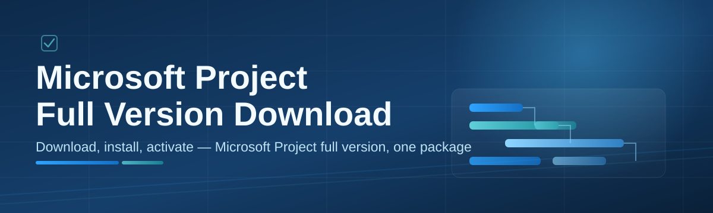

# ms-project-manager-suite 📊🚀

  

*A standalone Windows companion that streamlines how you plan, track, and ship projects — built by someone who was tired of clunky project tools too.*

  

---

## 🧭 Overview

I built **ms-project-manager-suite** because I kept bouncing between spreadsheets, sticky notes, and half-finished Gantt charts just to keep a mid-sized project on track. This is my genuine attempt at a lightweight, no-nonsense manager suite that wraps around the workflows people expect from Microsoft Project — timelines, resource allocation, milestone tracking — but packaged as a single, self-contained Windows application that respects your time and your disk space.

This project exists for the solo consultant juggling three client timelines, the small studio team that needs a shared Gantt view without a server, and the student who just wants to understand project scheduling without paying for a suite of enterprise tools upfront. Whenever people search for a **Microsoft Project full version download**, they're usually looking for exactly this: something that runs immediately, works offline, and doesn't ask you to sign into five different accounts before you can drag a single task bar. That's the itch this suite scratches.

Under the hood, it's a passion project — every release is tested on my own machine, every feature request gets read, and every bug report actually gets triaged (not just archived). If you've ever felt like project management software was built *against* you instead of *for* you, I think you'll feel at home here.

> [!NOTE]
> The landing page above is the **only** official source for this project. Everything you need — the download, changelog, and setup notes — lives there.

---

## ✨ What's Inside the Toolbox

> The heart of the project — everything I've poured into this suite so far, described plainly, no marketing fluff.

- **Native Gantt Canvas** — a hand-tuned rendering engine that draws timeline bars, dependencies, and critical paths without lag, even on projects with hundreds of tasks.

- **Resource Leveling Assistant** — automatically flags over-allocated team members and suggests redistribution before you ship a schedule that quietly falls apart.

- **Offline-First Architecture** — no login wall, no cloud sync requirement. Your project files stay on your machine, exactly where you put them.

- **Milestone & Baseline Tracking** — snapshot a plan, keep working, and compare actual progress against the original baseline at any point.

- **Multi-Project Dashboard** — a bird's-eye view across every active plan so you're never digging through five open windows to find the one deadline that matters today.

- **Custom Field Builder** — attach your own metadata (budget codes, client tags, risk scores) to tasks without waiting on a plugin marketplace.

- **Import/Export Compatibility Layer** — designed to play nicely with common project file formats so switching tools doesn't mean losing years of planning history.

- **Lightweight Reporting Engine** — generates clean status reports and burndown-style summaries you can actually hand to a stakeholder without extra formatting.

<strong>🔍 Click to see the full feature breakdown table</strong>

 

| Capability | Category | Status |
|---|---|---|
| Native Gantt Canvas | Visualization | ✅ Stable |
| Resource Leveling Assistant | Planning | ✅ Stable |
| Offline-First Architecture | Core | ✅ Stable |
| Milestone & Baseline Tracking | Tracking | ✅ Stable |
| Multi-Project Dashboard | Workflow | ✅ Stable |
| Custom Field Builder | Extensibility | 🧪 Beta |
| Import/Export Compatibility Layer | Interop | 🧪 Beta |
| Lightweight Reporting Engine | Reporting | ✅ Stable |
| Dark Mode Scheduling View | UI | ✅ Stable |

---

## 🚦 Getting Started (Step-by-Step)

Follow this like a recipe — it's genuinely this simple.

1. **Visit the landing page.** Click the download button above (or below) to open the official ms-project-manager-suite page.

2. **Grab the Windows package.** The landing page hosts the current 2026 build — just follow the on-page instructions to save it locally.

3. **Run the application.** Double-click the downloaded file. No installer wizard maze, no bundled toolbars, no surprise browser extensions.

4. **Open or create your first project.** Start from a blank timeline or import an existing plan, and you're scheduling within minutes.

> [!TIP]
> On first launch, take thirty seconds to explore the **Quick Setup** panel — it lets you pick a default theme and working-hours calendar so every new project starts configured the way *you* work, not the way a default template assumes you work.

---

## 🖥️ System Requirements

<strong>Click to expand minimum & recommended specs</strong>

 

| Requirement | Minimum | Recommended |
|---|---|---|
| OS | Windows 10 (64-bit) | Windows 11 (64-bit) |
| RAM | 4 GB | 8 GB+ |
| Storage | 250 MB free | 500 MB free |
| Display | 1280×720 | 1920×1080 |
| Dependencies | None — fully standalone | None — fully standalone |

  

> [!IMPORTANT]
> This is a standalone desktop application — there's nothing else to install first. If a page ever tells you that you need a separate "helper" download to run it, that page isn't mine.

---

## ⚙️ How It Works

The workflow is intentionally boring — in the best way. Boring means predictable, and predictable means you trust your own schedule.

1. **Landing page** hosts the current build for Windows.

2. **Download** pulls the standalone package to your machine.

3. **Launch** opens the suite directly — no background services spinning up.

4. **Plan** lets you build or import your project timeline.

5. **Track** keeps baselines, milestones, and resource loads in sync as work progresses.

---

<strong>🛟 Troubleshooting — Common Questions Answered</strong>

 

**Q: The app won't open after downloading — what's wrong?**
A: Windows SmartScreen sometimes flags new standalone apps it hasn't seen widely yet. Click "More info" then "Run anyway" from the SmartScreen prompt — this is standard for independently distributed Windows software.

**Q: Can I import an existing project file from another scheduling tool?**
A: Yes — use the Import/Export Compatibility Layer from the File menu. It's currently in beta, so back up your original file before converting.

**Q: My Gantt bars look misaligned after resizing the window.**
A: Toggle the "Recalculate Canvas" option under View — this forces the rendering engine to redraw at the current resolution.

**Q: Does this require an internet connection to run?**
A: No. Once downloaded, the suite is fully offline-first. You only need a connection to grab updates from the landing page.

**Q: Is there a way to reset my workspace settings without losing project files?**
A: Yes — hold Shift while launching to open Safe Mode, which resets UI preferences but never touches your saved `.msproj`-style files.

**Q: Why does resource leveling suggest changes I disagree with?**
A: It's a suggestion engine, not an enforcer. Review the flagged conflicts and dismiss any that don't fit your real-world constraints.

---

## 🎨 UI, UX & Personalization

> Small touches matter — a scheduling tool you enjoy opening is a scheduling tool you'll actually keep using.

- **Themes:** Light, Dark, and a high-contrast "Focus" mode for long planning sessions.

- **Keyboard-first workflow:**

    | Shortcut | Action |
    |---|---|
    | `Ctrl + N` | New project |
    | `Ctrl + S` | Save current plan |
    | `Ctrl + Shift + B` | Set baseline snapshot |
    | `Ctrl + G` | Jump to Gantt view |
    | `Ctrl + R` | Open Resource dashboard |
    | `F5` | Refresh timeline rendering |

- **Settings panel:** persistent per-user preferences for calendar rules, currency formatting, and default task duration units.

- **Layout memory:** the suite remembers your last panel arrangement between sessions, so you never have to re-dock windows every morning.

---

## 🤝 Contributing & Community

This started as a solo passion project, but it doesn't have to stay that way. If you've got ideas, found a rough edge, or want to help polish the Import/Export layer out of beta, contributions are genuinely welcome.

- Open an issue describing the bug or feature clearly — screenshots help enormously.

- Fork the repo, make focused changes, and submit a pull request with a clear description of *why*, not just *what*.

- Join the discussion threads if you want to shape where the roadmap goes next — resource forecasting and a timeline-diff viewer are both on deck.

> [!TIP]
> First-time contributors: look for issues tagged `good-first-issue` — they're scoped intentionally small so you can get a feel for the codebase without a huge lift.

> [!WARNING]
> Please don't open issues asking for redistribution mirrors or alternate download sources — the landing page linked in this README is the only supported source, and links posted elsewhere may not reflect the current build.

---

## 📄 License

Released under the [MIT License](LICENSE), 2026. Use it, learn from it, build on it — just keep the license notice intact.

---

## ⚖️ Disclaimer

ms-project-manager-suite is an independent, community-driven project and is **not affiliated with, endorsed by, or sponsored by Microsoft Corporation**. "Microsoft Project" is referenced here strictly to describe the category of project-scheduling software this suite is inspired by and compatible in spirit with. All trademarks belong to their respective owners. Download and use this software at your own discretion, and always keep backups of important project data.

